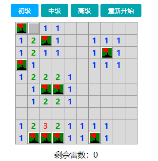

# MineSweeping
扫雷游戏，可通过切换难度进行游戏。  
难度配置：
```typescript
// arr是个二维数组，里面的每一个数组表示每个难度
// 每个难度里面有三个参数：第一个和第二个参数是雷区的行和列
// 第三个参数是雷区的雷的数量
let arr: number[][] = [[10, 10, 10], [16, 16, 40], [28, 28, 99]];
```  

